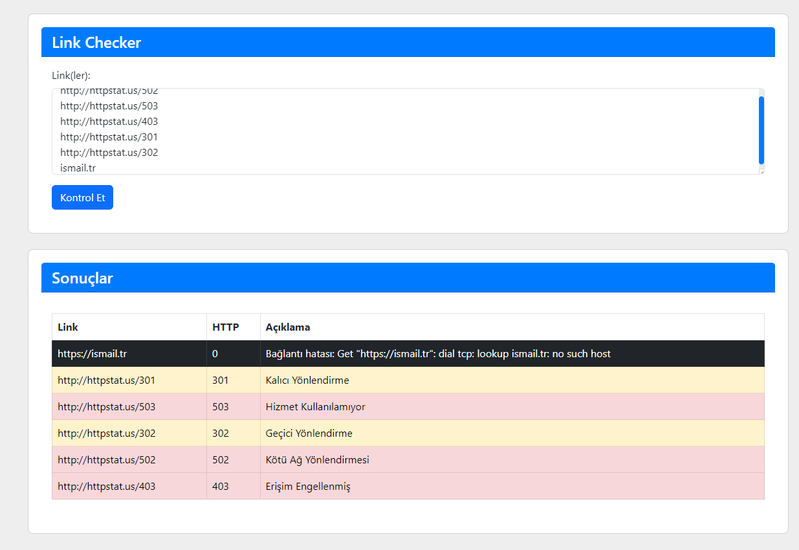

# Link Checker

Link Checker, verilen URL'lerin HTTP durum kodlarını kontrol eden basit bir Go uygulamasıdır. Bu uygulama, HTTP yanıtlarını alır ve yönlendirmeleri takip etmeden durum kodlarını belirler. Uygulama, ayrıca geçersiz domainleri kontrol eder ve uygun yanıtları JSON formatında döndürür.

## Özellikler

- URL'lerin HTTP durum kodlarını kontrol etme
- Yönlendirmeleri takip etmeme (301, 302 kodlarını işleme)
- Geçersiz URL'leri ve domainleri tespit etme
- JSON formatında yanıt döndürme

## Başlarken

### Gerekli Araçlar

1. [Go](https://go.dev/dl/) - Go dilini kurun.

### Go Projesini Çalıştırma

1. **Go'yu kurun**: Go'yu [bu bağlantıdan](https://go.dev/dl/) indirin ve kurun.

2. **Proje Dosyalarını İndirin**:
   ```bash
   git clone https://github.com/iatila/Link_checker_golang.git
   cd Link_checker_golang
   go run main.go
